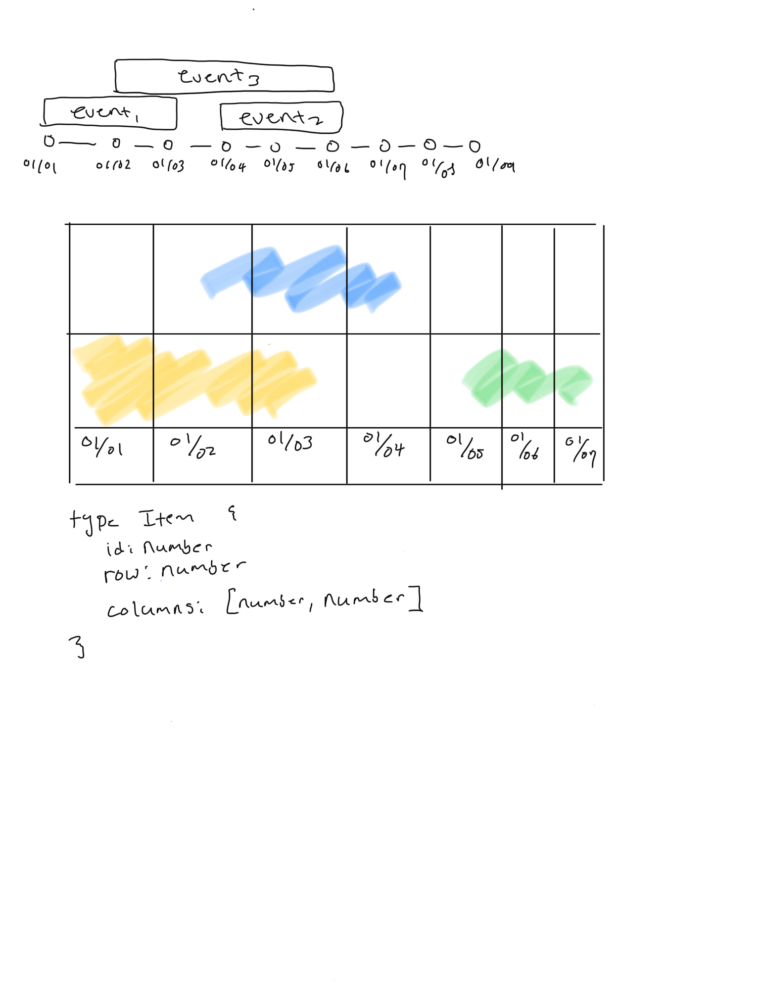

# Running the application

1. `git clone` this repository
2. `yarn start`

# How long did I spend on this assignment?

I spent 3-4 days on and off implementing the features. Overall time spent would be ~8-9 hours.

# What you like about your implementation

I took this opportunity to learn few things:

- CSS Grid
- Typescript
- React (our company uses Ember)

In terms of the actual application, figuring out how to align different events
were tricky. To determine which row an event goes, the implementation of
`RowComputator` (naming is hard... right?) was pretty fun to do.

# What would you change if you were going to do it again

I focused solely on the "monthly" view and that was a mistake. Everything relies
on the "month" unit. To support yearly, weekly, and even daily views, I wish I
would've considered making things a bit more generic.

# How you made your design decisions. For example, if you looked at other timelines for inspiration, please note that

I read the instructions and thought about the implementation. Here is my initial
drawing of the UI and implementation:

I went onto look at other calendar implementation like Google Calendar.

# How you would test this if you had more time

I included unit tests, but not integration tests. I remember reading about
[Storybook](https://storybook.js.org/) and would've liked to try writing tests
in it.

# Caveats

- Focused on logic rather than maing the UI look pretty.
- Didn't have time to properly implement accessibility :(
